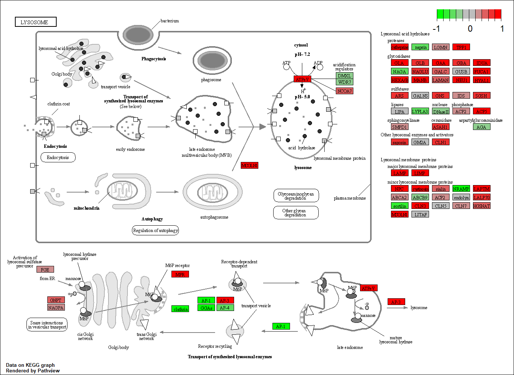

# Section 1

```{r}
metaFile <- "GSE37704_metadata.csv"
countFile <- "GSE37704_featurecounts.csv"

# Import the metadata and look at head
colData = read.csv(metaFile, row.names = 1)
head(colData)
```

```{r}
# Import the countdata
countData = read.csv(countFile, row.names = 1)
head(countData)
```

The length column in countdata must be removed before matching both files

> Q1. Complete the code below to remove the troublesome first column from countData

```{r}
# Note we need to remove the odd first $length col
countData <- as.matrix(countData[,-1])
head(countData)
```

We must exclude genes with zero read counts across all samples

> Q2. Complete the code below to filter countData to exclude genes (i.e. rows) where we have 0 read count across all samples (i.e. columns).

```{r}
countData = countData[rowSums(countData) > 0, ]
head(countData)
```

Run DESeq2

```{r}
library(DESeq2)
```

```{r}
dds <- DESeqDataSetFromMatrix(countData = countData, 
                              colData = colData,
                              design = ~condition)

dds = DESeq(dds)
```

```{r}
dds
```

Obtain results for HOXA1 Lnockdown vs. siRNA
```{r}
res = results(dds, contrast = c("condition", "hoxa1_kd", "control_sirna"))
```

> Q3. Call the summary() function on your results to get a sense of how many genes are up or down-regulated at the default 0.1 p-value cutoff.

```{r}
summary(res)
```

Volcano Plot

```{r}
plot( res$log2FoldChange, -log(res$padj))
```
> Q4. Improve this plot by completing the below code, which adds color and axis labels

```{r}
# Make color vector for all genes
mycols <- rep("gray", nrow(res))

# Color the genes red if absolute fold change is above 2
mycols[ abs(res$log2FoldChange) > 2 ] <- "red"

# Color those with adjusted p-value less than 0.01 
#  and absolute fold change more than 2 with blue
inds <- (res$padj < 0.01) & (abs(res$log2FoldChange) > 2)
mycols[inds] <- "blue"

plot(res$log2FoldChange, -log(res$padj), col = mycols, xlab = "Log2(FoldChange)", ylab = "-Log(P-value)" )
```
Adding Gene Annotations

> Q5. Use the mapIDs() function multiple times to add SYMBOL, ENTREZID and GENENAME annotation to our results by completing the code below.

```{r}
library("AnnotationDbi")
library("org.Hs.eg.db")
```

```{r}

columns(org.Hs.eg.db)

res$symbol = mapIds(org.Hs.eg.db,
                    keys = row.names(res), 
                    keytype = "ENSEMBL",
                    column = "SYMBOL",
                    multiVals = "first")

res$entrez = mapIds(org.Hs.eg.db,
                    keys = row.names(res),
                    keytype = "ENSEMBL",
                    column = "ENTREZID",
                    multiVals = "first")

res$name =   mapIds(org.Hs.eg.db,
                    keys = row.names(res),
                    keytype = "ENSEMBL",
                    column = "GENENAME",
                    multiVals = "first")

head(res, 10)
```

> Q6. Finally for this section let's reorder these results by adjusted p-value and save them to a CSV file in your current project directory.

```{r}
res = res[ order(res$pvalue), ]
write.csv(res, file = "deseq_results.csv")
```

# Section 2. Pathway Analysis

Install packages needed for pathway analysis

```{r}
library(gage)
library(gageData)
```

```{r}
data("kegg.sets.hs")
data("sigmet.idx.hs")

# Focus only on metabolic and signaling pathways 
kegg.sets.hs = kegg.sets.hs[sigmet.idx.hs]

# Examine first 3 pathways
head(kegg.sets.hs, 3)
```
Gage function requires vector of fold changes

```{r}
foldchanges = res$log2FoldChange
names(foldchanges) = res$entrez
head(foldchanges)
```

Gage pathway analysis can be done now

```{r}
keggres = gage(foldchanges, gsets = kegg.sets.hs)
```

Look at object returned by gage()

```{r}
attributes(keggres)
```

Look at first few "less" pathways

```{r}
head(keggres$less)
```

Make pathway plot with RNA-SEQ Expression Results

```{r}
library(pathview)
```

```{r}
pathview(gene.data = foldchanges, pathway.id = "hsa04110")
```


Generating a PDF output for the data

```{r}
pathview(gene.data=foldchanges, pathway.id="hsa04110", kegg.native=FALSE)
```

Find the top 5 up-regulated pathways and their IDs using the pathview() function

```{r}
# Top 5 up-regulated pathways
keggrespathways <- rownames(keggres$greater)[1:5]

# Extract IDs
keggresids = substr(keggrespathways, start=1, stop=8)
keggresids
```

Use pathview to draw plots for top 5 pathways

```{r}
pathview(gene.data = foldchanges, pathway.id = keggresids, species = "hsa")
```





> Q7. Can you do the same procedure as above to plot the pathview figures for the top 5 down-reguled pathways?

```{r}
# Top 5 down-regulated pathways
keggrespathways_down <- rownames(keggres$less)[1:5]

# Extract IDs
keggresids_down = substr(keggrespathways_down, start=1, stop=8)
keggresids_down
```

Use pathview to draw plots for top 5 down-regulated pathways

```{r}
pathview(gene.data = foldchanges, pathway.id = keggresids_down, species = "hsa")
```


# Section 3. Gene Ontology

```{r}
data(go.sets.hs)
data(go.subs.hs)

# Biological Process Subset of GO

gobpsets = go.sets.hs[ go.subs.hs$BP ]
gobpres = gage(foldchanges, gsets = gobpsets, same.dir = TRUE)

lapply(gobpres, head)
```

# Section 4. Reactome Analysis

Output list of significant genes at 0.05 level

```{r}
sig_genes <- res[res$padj <= 0.05 & !is.na(res$padj), "symbol"]
print(paste("Total number of significant genes:", length(sig_genes)))
```

```{r}
write.table(sig_genes, file="significant_genes.txt", row.names = FALSE, col.names = FALSE, quote = FALSE)
```

> Q8. What pathway has the most significant “Entities p-value”? Do the most significant pathways listed match your previous KEGG results? What factors could cause differences between the two methods?

Endosomal/Vacuolar pathway (Entities P-value: 2.02E-4)
-Some of the significant pathways listed match the previous KEGG results like the endosomal/vacuolar pathway (specifically the lysosome), the immune system, and the cell cycle. Olfactory transduction or a pathway similar to it could not be found on Reactome.
-Differences between the KEGG and Reactome databases could be responsible for some of the differences. KEGG is known to contain many different pathway definitions which could explain why pathways that were found via KEGG like olfactory trasnduction cannot be found on Reactome.

> Q9. What pathway has the most significant “Entities p-value”? Do the most significant pathways listed match your previous KEGG results? What factors could cause differences between the two methods?

"detection of chemical stimulus involved in sensory perception" was the most significant (Raw P-value = 6.71E-64, FDR = 1.05E-59)
-Some pathways like olfaction, cell cycle matched in both. The lysosomal pathway was not found on Genotology.
-Differences between the KEGG and GO databases could be responsible for some of the differences. KEGG is known to contain many different pathway definitions which could explain why pathways that were found via KEGG like the lysosome pathway cannot be found on GO.


